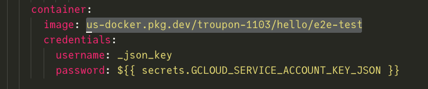

1. Enable Artifact Registry API for the project.

    https://console.cloud.google.com/apis/library/artifactregistry.googleapis.com?project=<project_id>

    

2. Create repository in Artifact Registry

    https://console.cloud.google.com/artifacts?folder=&organizationId=&project=<project_id>

    

    

3. Create Service account

    https://console.cloud.google.com/iam-admin/serviceaccounts?project=<project_id>

    

4. Create Service account key of JSON type and download the key file.

    

5. Add Service account to artifact repository with following role:

    - Artifact Registry Writer
    
    Select the checkbox by the repository name and click `Add  Members` button in `Permissions` tab from the right panel.

    Add the service account email and select the `Artifact Registry Writer` role.
    
    

    Then click `Save` button.

6. Click the repository name to reveal the images in the repository. 

    Then click the copy icon to copy the repository URL.

    

7. Set the copied URL in the workflow files.

    
    
    

8. Set Service account key file contents in Secrets for the project.

    The Secret Name is `GCLOUD_SERVICE_ACCOUNT_KEY_JSON`

    

